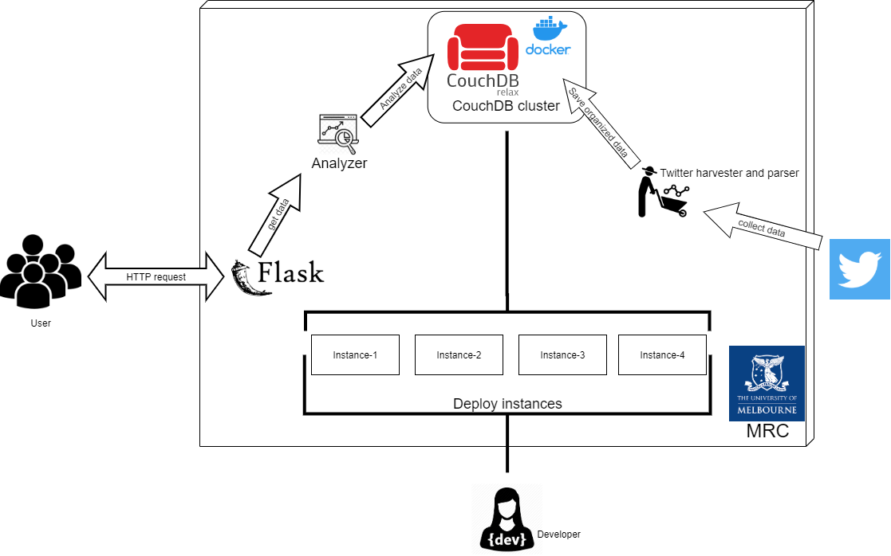

# COMP90024 Assignment 2

## City Analytics on the Cloud - Group 22

### System Functionalities:

1. Develop Cloud infrastructure for supporting the following autonomy and data analysis
2. Automatically harvest twitter data from social media
3. Automatically deploy the CouchDB for data storage and analysis
4. Automatically preprocess data before embedding them to couchDB
5. Use Mapreduce function in CouchDB to do analysis for 5 different scenarios and compare the result to data on Aurin
6. Display our analyzed result on front end with graphs and map

Simple illustration of the system is shown in the figure below.

### Scenarios for analysis:

1. How do different language tweets correlate to language spoken at home?
2. What is the difference between iPhone and Android users towards twittering?
3. What is the pattern of people accessing tweets in a 24 hours period?
4. What are the trends of attention and attitudes of people towards Covid vaccines?
5. What are the trends of attention and attitudes of people towards unemployment? 
6. What is the correlation of people talking about unemployment on tweet and the unemployment and youth unemployment rate?

### Contributors

Ran Liang 		1162222

Yulun Huang 	910398

Yubo Sun 		1048638

Yanhao Wang 	1142087

Xindi Fang 		749394

### Links

Web address: http://172.26.130.240:5000 (Need connection to the unimelb network first)

Demonstration Video link: https://youtube.com/playlist?list=PLTaCIQqMUNXi4Ek6jbj0JMC2ZhHlzFexI